# Groupomania Social Network

Groupomania is a full-stack internal social network designed to encourage communication and interaction between employees.

Users can create an account, manage their profile, publish text or image posts, interact through likes and comments, and search for other employees. The application includes a responsive Vue.js frontend, a REST API built with Node.js and Express, and a MySQL database.

## Application Preview

### Authentication

| Login | Sign Up |
| --- | --- |
| 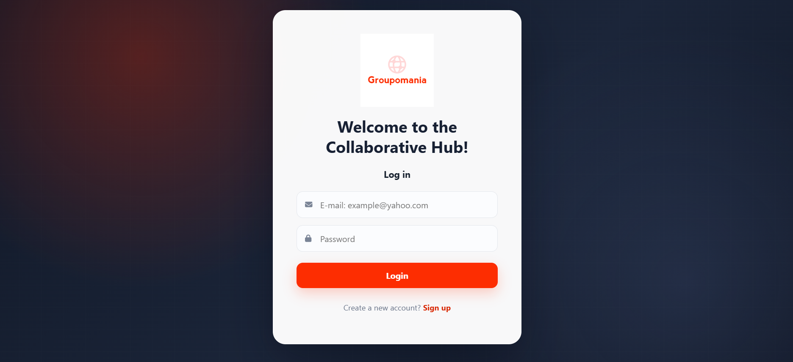 | 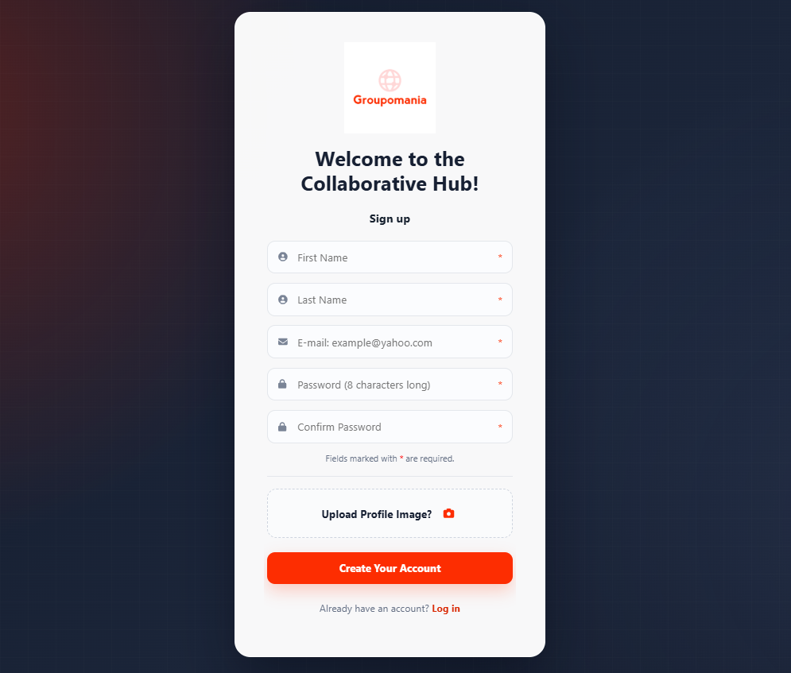 |

### Home Feed and Posts

| Create a Post | Post Interactions |
| --- | --- |
| 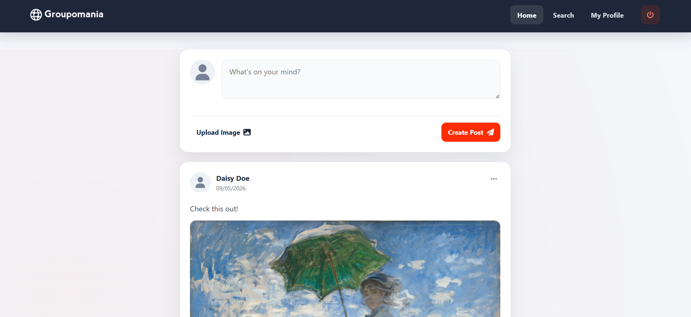 | 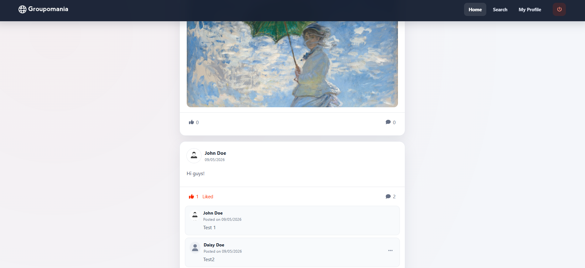 |

| Personalised Feed | Employee Search |
| --- | --- |
| 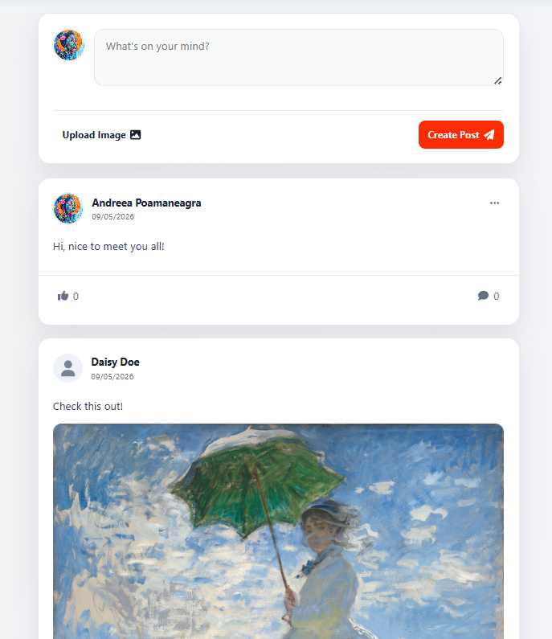 | 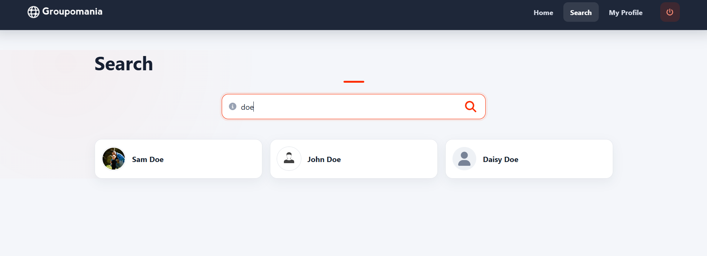 |

### Profiles and Account Management

| User Profile | Profile Settings |
| --- | --- |
| 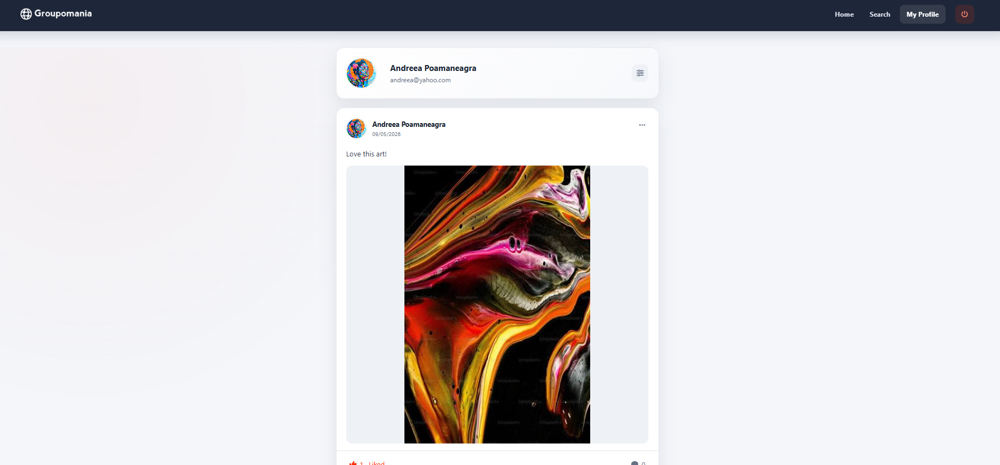 | 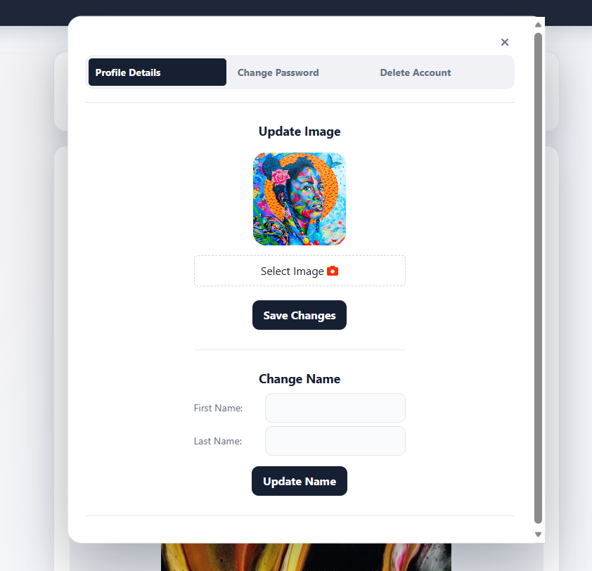 |

| Change Password | Delete Account |
| --- | --- |
| 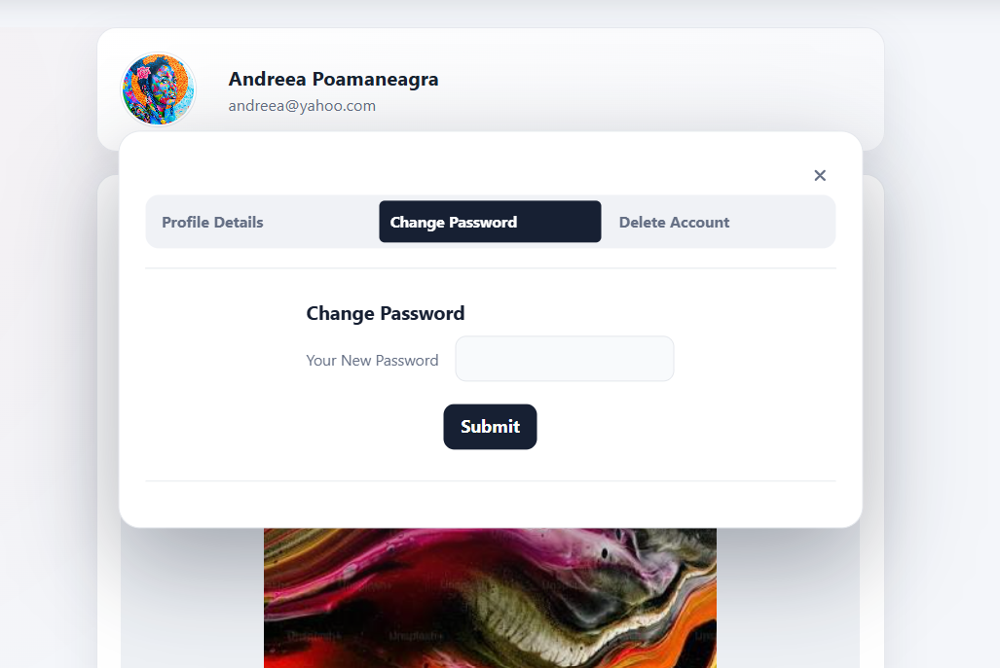 | 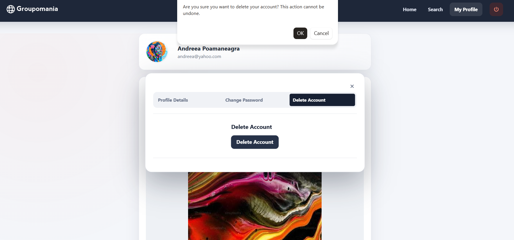 |

| Account Deletion Confirmation | Searched User Profile |
| --- | --- |
| 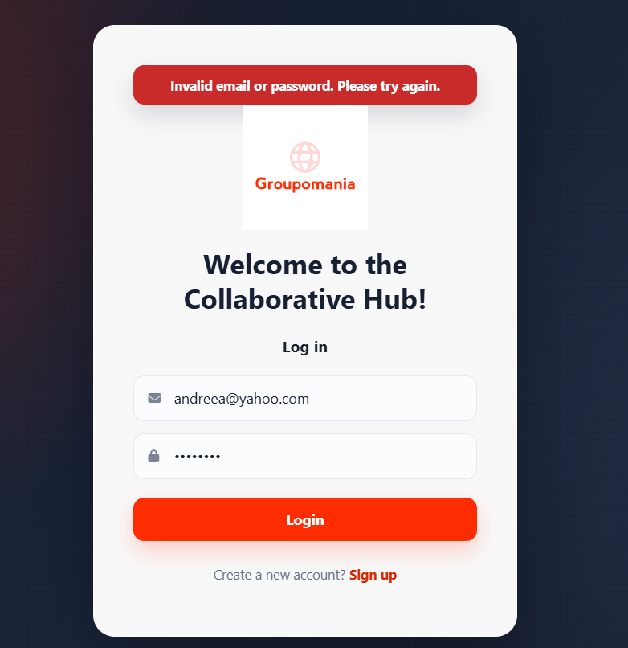 | 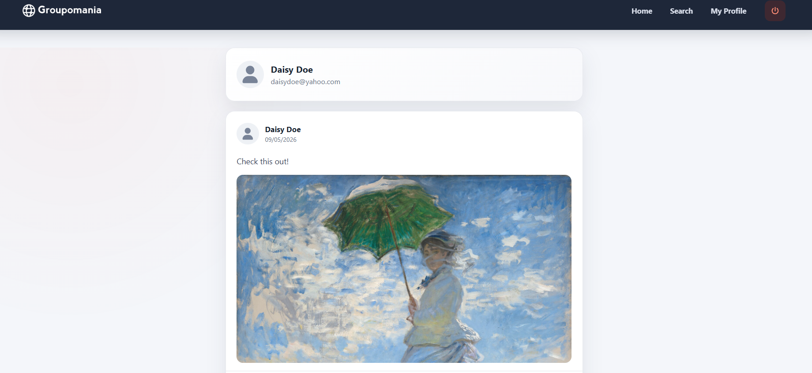 |

## Key Features

- User registration and authentication
- Optional profile image during account creation
- Personalised employee feed
- Text and image posts
- Likes and comments
- Employee search
- Individual user profiles
- Profile name and image updates
- Password changes
- Account deletion
- Confirmation and error notifications
- Responsive interface for desktop and smaller screens

## Technologies Used

### Frontend

- Vue.js 3
- Vue Router
- Vuex
- JavaScript
- HTML5
- SCSS
- Axios
- Font Awesome

### Backend

- Node.js
- Express.js
- REST API
- JSON Web Tokens
- bcrypt
- Multer
- Helmet
- Morgan
- Winston

### Database

- MySQL
- mysql2

### Development Tools

- Git
- GitHub
- Visual Studio Code
- npm

## Getting Started

### Prerequisites

Install the following software:

- [Node.js](https://nodejs.org/) — v18.16.0
- [MySQL](https://dev.mysql.com/downloads/) — v8.0.34
- [Vue CLI](https://cli.vuejs.org/) — v5.0.8

### Clone the Repository

```bash
git clone https://github.com/AndreeaVP/Groupomania-Social-Network.git
cd Groupomania-Social-Network
```

### Database Setup

1. Create a MySQL database for the project.
2. Import the provided `backend/database_structure.sql` file.
3. Inside the `backend` directory, create a `.env` file.
4. Add your own database details:

```env
DB_HOST=your_database_host
DB_USER=your_database_user
DB_PASSWORD=your_database_password
DB_NAME=your_database_name
```

The `.env` file contains private configuration and must not be committed to GitHub.

### Run the Backend

```bash
cd backend
npm install
npm start
```

The backend runs at:

```text
http://localhost:3000
```

### Run the Frontend

Open a second terminal from the main project directory:

```bash
cd frontend
npm install
npm run serve
```

The frontend runs at:

```text
http://localhost:8080
```

## Project Structure

```text
Groupomania-Social-Network/
├── backend/
│   ├── config/
│   ├── controllers/
│   ├── middleware/
│   ├── routes/
│   └── database_structure.sql
├── frontend/
│   ├── public/
│   └── src/
│       ├── assets/
│       ├── components/
│       ├── router/
│       ├── store/
│       ├── styles/
│       └── views/
└── screenshots/
```

## What I Learned

This project gave me practical experience building a complete full-stack application and connecting a Vue.js frontend to a Node.js and Express backend.

I developed experience with user authentication, REST API communication, relational database operations, image uploads, application state management, responsive design, troubleshooting, and version control with Git and GitHub.

I also strengthened my ability to organise a larger project, connect frontend and backend functionality, investigate technical problems, and work toward project requirements and deadlines.

## Project Status

The core application and its main functionality are complete. The interface was subsequently redesigned to improve visual consistency, responsiveness, and usability.

## Author

**Andreea Poamaneagra**

[GitHub Profile](https://github.com/AndreeaVP)
